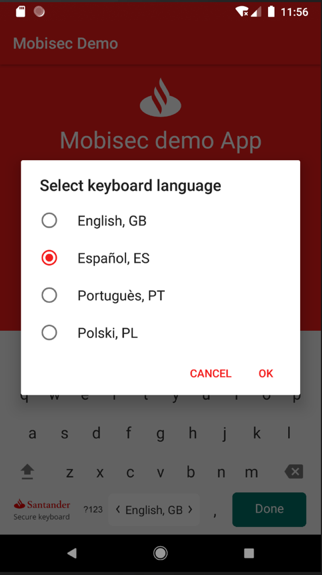

<!--

Old documentation:

## Secure Keyboard Module
#### [Integration documentation:](https://confluence.ci.gsnet.corp/pages/viewpage.action?pageId=144050877)
#### [Technical documentation:](https://confluence.ci.gsnet.corp/display/COMOBILEPLAT/Android+Secure+Keyboard)

-->

# Secure Keyboard Module 
## Integration Guide (MobiSec Development)

# Versioning
| Version | Author |                       Comments                 | Date |
|---------|--------|------------------------------------------------|---------|
|1.0|	Guillermo Guerrero	|Initial document|	17/05/19 |
|1.1|	Carlos Rodríguez	|Update document according to release 1.0.0|	21/05/19|
|1.2|	Carlos Rodríguez	|Update diagrams + Javadoc + integration for new features: AutoScrolling + Custom EditText|	15/10/19|
|1.3|	Carlos Rodríguez	|Copy documentation + Update Limitations|	13/01/20|

# Index
- [1. Introduction](#1-introduction)
  -   [1.1 Secure Edit Text](#11-secure-edit-text)
  -   [1.2 Keyboard Types](#12-keyboard-types)
        -    [Alphanumeric](#alphanumeric)
        -    [Alphanumeric - Special Chars](#alphanumeric-special-chars)
        -    [Decimal](#decimal)
        -    [Numeric](#numeric)
  -   [1.3 Top Row Buttons](#13-top-row-buttons)
  -   [1.4 Keyboard Languages](#14-keyboard-languages)
        -   [1.4.1 Alternative Characters](#141-alternative-chars)
  -   [1.5 Autoscrolling](#15-autoscrolling)
  -   [1.6 Lifecycle Awareness](#16-lifecycle-awareness)
- [2. Integration](#2-integration)
  -   [2.1 Nexus Integration](#21-nexus-integration)
  -   [2.2 Local Integration](#22-local-integration)
  -   [2.3 Usages](#23-usages)
  -   [2.4 Keyboard Customization](#24-keyboard-customization)
        -   [2.4.1 Custom Buttons](#241-custom-buttons)
        -   [2.4.2 Buttons & TextWatchers](#242-buttons--textwatchers)
        -   [2.4.3 Custom Actions](#243-custom-actions)
  -   [2.5 Secure Edit Text Customization](#25-secure-edit-text-customization)
        -   [2.5.1 Simple Customization](#251-simple-customization)
        -   [2.5.2 Regular Customization](#252-regular-customization)
        -   [2.5.3 Advanced Customization](#253-advanced-customization)
  -   [2.6 AutoScrolling](#26-autoscrolling)
        -   [2.6.1 Introduction Example](#261-introduction-example)
        -   [2.6.2 Non-Strict Mode VS Strict Mode](#262-non-strict-mode-vs-strict-mode)
        -   [2.6.3 Identifying Root Layout](#263-identifying-root-layout)
        -   [2.6.4 Integration in Activity](#264-integration-in-activity)
        -   [2.6.5 Integration in Fragments](#265-integration-in-fragments)
        -   [2.6.6 Integrating layouts with a ScrollView (or NestedScrollView) ](#266-integrating-layouts-with-a-scrollview-or-nestedscrollview)
        -   [2.6.7 Integration in ViewPagers](#267-integration-in-viewpagers)
    -   [2.7 Change Keyboard Language](#27-change-keyboard-language)
        -   [2.7.1 Alternative Chars](#271-alternative-chars)
    -   [2.8 Lifecycle Awareness](#28-lifecycle-awareness)
    -   [2.9 Tapjacking Protection](#29-tapjacking-protection)
- [3. Limitations](#3-limitations)


# 1. Introduction

This module offers a Secure Keyboard (working in companion with a Secure Edit Text) implementation in order to interact with app forms. 

This keyboard also includes protection against to tapjacking

> NOTE: Secure Keyboard it’s not developed as an IME (Input Method Editor) so it works in an independent way from the Android System (see [Limitations](#3-limitations) for further information)

## 1.1. Secure Edit Text

This is the basic widget that developers must include in their layouts in order to use the Secure Keyboard. From this widget, developers can configure Secure Keyboard to use with this Secure Edit Text

It’s a custom implementation of ```AppCompatEditText``` associated with a Secure Keyboard instance that it’s automatically controlled by the Secure Edit Text. 


|| 
|:-------------------------------------------------------:|
| *Secure Edit Text showing its Secure Keyboard instance* |


Secure Edit Text has been developed so that developers can extend and customize view for Secure Edit Text:

|  |  |
|:------:|:------:|
| *Simple Customization* | *Advanced Customization* |

## 1.2 Keyboard Types

The Keyboard offers three types:

#### Alphanumeric

| *English version* | *Spanish version* |
|:-------------------------------------------------------:|:-------------------------------------------------------:|
||| 

| *Portuguese version* | *Polish version* |
|:-------------------------------------------------------:|:-------------------------------------------------------:|
||| 

#### Alphanumeric - Special Characters

| *Special Chars (All languages) - Page 1* | *Special Chars (All languages) - Page 2* |
|:-------------------------------------------------------:|:-------------------------------------------------------:|
||| 

#### Decimal 

| *English version* | *Spanish, Portuguese & Polish version* |
|:-------------------------------------------------------:|:-------------------------------------------------------:|
||| 

#### Numeric 

| *Numeric (All languages)*  |
|:---------------------------------------------------------:|
|| 


## 1.3 Top Row Buttons
The previous keyboards can include an additional row on the top to include flow control buttons such as *continue* or *cancel*

| *One Button Top Row* | |
|:-------------------------------------------------------:|-------------------------------------------------------|
|| English version |
|| Spanish & Portuguese version|
|| Polish version|

| *Two Button Top Row* | |
|:-------------------------------------------------------:|-------------------------------------------------------|
|| English version |
|| Spanish & Portuguese version|
|| Polish version|

## 1.4 Keyboard Languages
If more than one language is available for the keyboard, the user can change between them by long-pressing the space bar. A dialog will prompt to let the user pick a language. Changing the keyboard language will not change the application’s language.

|| 
|:---------------------------------------------------------:|
| *Language selection dialog*  |

Currently, the following languages are available to choose within the Secure Keyboard:
* English 
* Spanish 
* Portuguese 
* Polish

### 1.4.1 Alternative Chars

Depending on the language selected, some keys contains alternative characters that could be inserted by clicking multiple and sequentially in a key to change to the next alternative character or by long-pressing the key to see a popup menu containing the alternates.

|| 
|:---------------------------------------------------------:|
| *Alternate keys for “A” key in Portuguese keyboard version*  |

## 1.5 AutoScrolling

**AutoScrolling** is an experimental (see [Limitations](#3-limitations) ) feature introduced from version 2.0.0 that adds scrolling behavior for the layout where Secure Edit Text is placed.

**AutoScrolling** system tries to simulate same scrolling behavior that Android System does with IME when an ```EditText``` is touched: The system scrolls to the field in order to make it totally visible and focused so, the main goal of this, is to make the ```SecureEditText``` not get hidden by system widgets or the Secure Keyboard itself

||| 
|:-------------------------------------------------------:|:-------------------------------------------------------:|
| *Layout before scroll to position* | *Layout scrolled to Password Edit Text <br> when clicking it* |

In contrast to an IME, auto-scrolling must be enabled manually by developers to make it work.

## 1.6 Lifecycle Awareness

Since version 2.0.0, ```SanEditText``` is **lifecycle aware** in order to get destroyed at same time that its parent and avoid memory leaks by unreleased resources in use.

Lifecycle, destroying and other related processes are automatically handled by the ```SecureEditText```. The only condition required to developers to make it work correctly is to proportionate adequate ```Context``` instance

| *Lifecycle Diagram*  |
|:---------------------------------------------------------:|
|| 


# 2. Integration

**Requirements:**

- **Secure Keybaord version 2.0.2**

## 2.1 Nexus Integration

Integration of **Secure Keyboard** module preferred way is done via **Nexus Repository**. Developers have to include the following code in the ```build.gradle``` to configure access to the Globile’s Nexus Repository. Add the maven node to the main repositories node:

```groovy
 repositories {
 
     ...

     maven {
         url 'http://nexus-globile.eastus.cloudapp.azure.com:8081/repository/maven-releases'
         credentials {
             username 'user'
             password 'password'
         }

     }

     ...

 }
```

> Ask DevOps team to request user credentials

In the ```dependencies``` node, add the following:

```groovy
 dependencies {

     ...

     implementation 'com.globile.santander.mobisec:securekeyboard:{version_here}'

     ...
```

## 2.2 Local Integration

Alternatively, developers can manually download the project from repository and import by clicking in ***File > New… > Import module…*** and select the root folder where repository was downloaded

First, include the project in ```settings.gradle``` file of your project:

```groovy
include ':sansecurekeyboard'
```

Then, in the dependencies node, add the following:

```groovy

 dependencies {

     ...

     implementation project(':sansecurekeyboard') 

     ...

 }

```

> NOTE: ‘sansecurekeyboard’ is the folder where the code should be in the application folder. The developer may change these values.

## 2.3 Usages

To start using the Secure Keyboard, developers must include the ```SanEditText``` widget (default implementation of Secure Edit Text) in theirs layouts in order to capture user input text. 

Use the following snippet to include the Secure Edit Text that will launch the Secure Keyboard:

```xml
 <com.globile.santander.mobisec.securekeyboard.SanEditText
    android:id="@+id/login_password"
    android:layout_width="match_parent"
    android:layout_height="@dimen/editext_rounded_height"
    android:hint="@string/enter_pincode"
    android:inputType="numberPassword"
    android:privateImeOptions="nm"
    android:textColorHint="@color/ui_white_translucent"
    android:textColor="@color/ui_white"
    android:theme="@style/SanEditTextTheme"	
    app:sanKeyboardType="numeric"
    app:sanKeyboardButtons="continueOnly"
    android:imeOptions="actionDone"/>
```

The ```imeOptions``` ```actionNext``` and ```actionDone``` are compatible with ```SanEditText``` and ```SanKeyboard```.

## 2.4 Keyboard Customization

As part of the customization, developers would change the keyboard type and/or add a top row with flow control button such as *Cancel* and *Continue* buttons. 

The current available parameters are listed below:

* For customizing keybaord type:

| ```sanKeyboardType```| Description|
|---------------|---|
|```alpha```| Alphanumeric keyboard|
|```alphaUpper``` |Alphanumeric keyboard with all upper letters|
|```alphaUpperPerm```|Alphanumeric keyboard with all upper letters per-manently|
|```decimal```|Numeric keyboard with done button|
|```numeric```|Simple numeric keyboard|

* For customizing **Top Row Buttons**:

| ```sanKeyboardButtons```| Description|
|---------------|---|
|```none```|  The upper row will not appear|
|```continueOnly``` |A red “Continue” button will span the whole upper row|
|```cancelContinue```|Two buttons will appear in the upper row: “Cancel” and “Continue”|

### 2.4.1 Custom Buttons

Currently, there are four additional buttons to show within the keyboard layout. They are defined in the ```SanKeyboard``` class.

* ```ContinueOnly```: The continue button that spans all the top row.
* ```Cancel```: The button at the left of the top row, when there are two.
* ```Continue```: The button at the left of the top row, when there are two.
* ```Done```: The button at the bottom right.

Their appearance is defined in the ```SanCustomKeyData``` inner class and are automatically created with the keyboard. They are language sensitive, as shown in the screenshots. 

By default, all buttons are shown as enabled. To toggle the enabled status of the button, call the ```enableDisableCustomKey()``` method of the ```SanEditText``` class.

Example:
```java
 loginPassword.enableDisableCustomKey(SanKeyboard.KEYCODE_CONTINUE, false);
```
The method will do nothing if the key passed to it is not a custom key.

### 2.4.2 Buttons & TextWatchers

A ```NotEmptyTextWatcher``` can be added to the ```SanEditText```, to make the indicated custom button become enabled only if the ```SanEditText``` is not empty.

Example:

```java
loginPassword.addTextChangedListener(new NotEmptyTextWatcher(SanKeyboard.KEYCODE_CONTINUE, loginPassword));
```

### 2.4.3 Custom Actions

By default, when any custom button is clicked, the keyboard gets hidden.

In order to add more actions, developers may create a ```SanKeyboardCallback``` interface and set it to the ```SanEditText```. The same callback may be set in various ```SanEditText``` but the idea is that every ```SanEditText``` should have a different callback.

The callback has two methods: 
1.	```onContinueClick()```: Called when the continue button is clicked.
2.	```onCancelClick()```: Called when the cancel button is clicked.

The developer may use the ```abstract``` class ```SanKeyboardCallbackImpl``` and override one or both of the above methods.

Example:
```java
private SanKeyboardView.SanKeyboardCallback loginPasswordKeyboardCallback = new SanKeyboardView.SanKeyboardCallbackImpl() {

    @Override
    public void onContinueClick() {
        // On Continue click actions 
    } 

	@Override
	public void onCancelClick() {
        // On Cancel click actions
    }

};
```

## 2.5 Secure Edit Text Customization

Developers can customize **Secure Edit Text** view to meet their own designs. Depends on the complexity of design, customization could be easy or to require more job to be fully integrated

| *Default rendering for Secure Edit Text (```SanEditText```)*  |
|:---------------------------------------------------------:|
|| 


### 2.5.1 Simple Customization

This is the easiest way to custom the Secure Edit Text. You can use this approximation if your design doesn’t require to add or change behavior of Secure Edit Text. 

The simplest way to change view changing is the background. Normally, simple designs can be met by changing only the background of the Secure Edit Text

Developers can do this also by applying styles to Secure Edit Text. For example, creating the following style (```styles.xml```) called ```my_edit_text_style```:

```xml
 <resources>

  ...

   <style name="my_edit_text_style" parent="Widget.AppCompat.EditText">
      <item name="android:background">@drawable/set_background</item>
      <item name="android:height">50dp</item>
      <item name="android:paddingLeft">8dp</item>
      <item name="android:paddingStart">8dp</item>
      <item name="android:fontFamily">@font/santander_text_regular</item>
      <item name="android:layout_marginLeft">16dp</item>
      <item name="android:layout_marginRight">16dp</item>
   </style>

  ...

 </resources>
```
This style is using a layer-list drawable, but developers can use other drawables or images as background. This is the code for ```drawable/set_background```: 
```xml
 <?xml version="1.0" encoding="utf-8"?>
 <layer-list xmlns:android="http://schemas.android.com/apk/res/android">
    <item>
        <shape android:shape="rectangle">
            <solid android:color="#f5f9fb" />
            <corners android:radius="5dp" />
        </shape>
    </item>
    <item android:gravity="bottom">
        <shape android:shape="rectangle">
            <size android:height="1dp " />
            <solid android:color="#dce0e1" />
        </shape>
    </item>
 </layer-list>
```
Finally, the style must be applied to the Secure Edit Text in order to be customized:

```xml
<com.globile.santander.mobisec.securekeyboard.SanEditText
    style="@style/my_edit_text_style"
    android:layout_width="match_parent"
    android:layout_height="wrap_content"
    ... />
```

Now the ```SanEditText``` renders this way:


### 2.5.2 Regular Customization
Use this approximation if you need to add functionality for the Secure Edit Text. 

For example, let’s imagine that we want to add a button to reset the field after clicking it. And this button, is included in the same box as the field in the designs:


To accomplish this design, we have to create our own custom view wrapping the Secure Edit Text in it. 

Firstly, we have to define the layout. Observe that:

* For simplicity, background for root ```RelativeLayout``` is using the same as the previous example 
* ```SanEditText``` is contained in the custom view
* ```ImageView``` will represent the **X** button to reset the field

```xml
<?xml version="1.0" encoding="utf-8"?>
 <RelativeLayout xmlns:android="http://schemas.android.com/apk/res/android"
                android:background="@drawable/set_background"
                android:layout_width="match_parent"
                android:layout_height="@dimen/et_height">

    <com.globile.santander.mobisec.securekeyboard.SanEditText
        style="@style/my_edit_text_style"
        android:id="@+id/secure_edit_text"
        android:background="@drawable/set_background"
        android:layout_width="match_parent"
        android:layout_height="@dimen/et_height"
        android:layout_alignParentStart="true"
        android:layout_alignParentLeft="true"
        android:layout_toLeftOf="@id/v_separator"
        android:layout_toStartOf="@id/v_separator"
        android:hint="@string/secure_keyboard_alphanumeric"
        android:textCursorDrawable="@drawable/edit_text_cursor_shape"
        android:layout_margin="0dp"
        android:padding="0dp"/>

    <View
        android:id="@+id/v_separator"
        android:layout_width="1dp"
        android:layout_height="match_parent"
        android:background="@color/gray_bsan"
        android:layout_margin="4dp"
        android:layout_marginTop="8dp"
        android:layout_marginBottom="8dp"
        android:layout_toLeftOf="@id/iv_delete_button"
        android:layout_toStartOf="@id/iv_delete_button"/>

    <ImageView
        android:id="@+id/iv_delete_button"
        android:layout_width="48dp"
        android:layout_height="48dp"
        android:scaleType="fitCenter"
        android:layout_marginEnd="8dp"
        android:layout_marginRight="8dp"
        android:src="@android:drawable/ic_menu_close_clear_cancel"
        android:layout_alignParentRight="true"
        android:layout_alignParentEnd="true"/>

 </RelativeLayout>
```
And this is the Java code for the custom view. Observe that:

* The name of our new custom view is ```RegularCustomEditTextExample```
* A reference to the wrapped ```SanEditText``` is held to accomplish behaviour from reset button

```java
public class RegularCustomEditTextExample extends RelativeLayout {

    private ImageView ivDeleteButton;
    private SanEditText setEditText;

    public RegularCustomEditTextExample(Context context) {
        super(context);
        initView(context, null);
    }

    ...

    private void initView(Context context, AttributeSet attrs) {

        LayoutInflater inflater = (LayoutInflater) context
                .getSystemService(Context.LAYOUT_INFLATER_SERVICE);
        
        if (inflater != null){
            inflater.inflate(R.layout.secure_keyboard_regular_custom_edit_text, this, true);
        }

        ivDeleteButton = findViewById(R.id.iv_delete_button);
        setEditText = findViewById(R.id.secure_edit_text);

        // On click image, reset SanEditText
        ivDeleteButton.setOnClickListener(v -> setEditText.setText(""));

    }

    ...

 }
```

Finally, developers must include the new custom view in their layouts to use it:
```xml
 <com.example.packagename.customviews.RegularCustomEditTextExample
    android:id="@+id/rcet_secure_keyboard_custom_edit_text_regular_edit_text"
    android:layout_width="match_parent"
    android:layout_height="wrap_content"
    android:layout_marginRight="8dp"
    android:layout_marginEnd="8dp"
    android:layout_marginStart="8dp"
    android:layout_marginLeft="8dp"
    android:layout_marginBottom="16dp"/>
```

In this example, is supposed that ```RegularCustomEditTextExample``` is inside package hierarchy ```com/example/packagename/customviews```

> If you need more information about creating custom views, visit official documentation:
> [Custom Components at Android Official Guide](https://developer.android.com/guide/topics/ui/custom-components) 

### 2.5.3 Advanced Customization

Use this approximation if you need to extend or change functionality for the Secure Edit Text. 

Let’s extend the previous example adding now a label to the top of Secure Edit Text to show a hint and another button to change keyboard associated to the Secure Edit Text


This time, we are going to create:

* Custom extension of Secure Edit Text to wrap extra functionality for ```EditText```
* Custom view to wrap our custom extension of Secure Edit Text and add the rest of the behaviour required

Firstly, let’s create custom extension for Secure Edit Text. This can be done by extending ```BaseSecureEditText``` class and implementing default methods. This is the code for this extension. Observe that:

* A method (```deleteEditTextContet()```) to reset the field is created (to be called by reset button)
* A method (```toggleKeyboardType()```) to toggle the keyboard type is created (to be called by the other button)

```java
public class MyCustomEditText extends BaseSecureEditText {

    private Context context;

    public MyCustomEditText(Context context) {
        super(context);
        this.context = context.getApplicationContext();
    }

    ...

    public void deleteEditTextContent() {
        setText("");
    }

    public void toggleKeyboardType() {

        boolean showKeyboard = false;

        if (isSanKeyboardShown()) {
            hideSanSecureKeyboard();
            showKeyboard = true;
        }

        if (getKeyboardType() == SanKeyboardType.NUMERIC) {

            super.setKeyboardType(SanKeyboardType.ALPHA);
            setHint(context.getString(R.string.secure_keyboard_alphanumeric));
            deleteEditTextContent();

        } else {

            super.setKeyboardType(SanKeyboardType.NUMERIC);
            setHint(context.getString(R.string.secure_keyboard_numeric));
            deleteEditTextContent();

        }

        if (showKeyboard) {
            showSanSecureKeyboard();
        }

    }
 }
```

> NOTE: When extending the ```BaseSecureEditText``` class, we recommend to only add new functionality and not modifying (or overriding) the existing one to avoid unexpected behaviours

Now, like in the previous example, we create a custom view to wrap the Secure Edit Text but this time, instead of a ```SanEditText``` will be a ```MyCustomEditText``` instance. Also, we include a ```TextView``` for showing the label and another ```ImageView``` for the toggle keyboard button:

```xml
<?xml version="1.0" encoding="utf-8"?>
 <LinearLayout xmlns:android="http://schemas.android.com/apk/res/android"
              style="@style/my_edit_text_style "
              android:layout_width="match_parent"
              android:layout_height="wrap_content"
              android:padding="0dp"
              android:layout_margin="0dp"
              android:orientation="vertical">

    <TextView
        android:id="@+id/tv_custom_label"
        android:layout_width="match_parent"
        android:layout_height="wrap_content"
        android:layout_marginStart="8dp"
        android:layout_marginLeft="8dp"
        android:text="Username"/>

    <RelativeLayout
        android:layout_width="match_parent"
        android:layout_height="wrap_content">

        <com.globile.santander.mobisec.app.customviews.MyCustomEditText
            style="@style/my_edit_text_style "
            android:id="@+id/secure_edit_text"
            android:layout_width="match_parent"
            android:layout_height="wrap_content"
            android:padding="0dp"
            android:layout_margin="0dp"
            android:layout_toStartOf="@id/iv_change_keyboard_button"
            android:layout_toLeftOf="@id/iv_change_keyboard_button"
            android:hint="@string/secure_keyboard_alphanumeric"
            android:textCursorDrawable="@drawable/edit_text_cursor_shape"/>

        <ImageView
            android:id="@+id/iv_change_keyboard_button"
            android:layout_width="48dp"
            android:layout_height="48dp"
            android:scaleType="fitCenter"
            android:layout_marginStart="8dp"
            android:layout_marginLeft="8dp"
            android:layout_marginEnd="8dp"
            android:layout_marginRight="8dp"
            android:src="@drawable/key_secure_keyboard"
            android:layout_toLeftOf="@id/v_separator"
            android:layout_toStartOf="@id/v_separator"/>

        <View
            android:id="@+id/v_separator"
            android:layout_width="1dp"
            android:layout_height="48dp"
            android:background="@color/gray_bsan"
            android:paddingTop="8dp"
            android:paddingBottom="8dp"
            android:layout_toLeftOf="@id/iv_delete_button"
            android:layout_toStartOf="@id/iv_delete_button" />

        <ImageView
            android:id="@+id/iv_delete_button"
            android:layout_width="48dp"
            android:layout_height="48dp"
            android:scaleType="fitCenter"
            android:layout_marginEnd="8dp"
            android:layout_marginRight="8dp"
            android:src="@android:drawable/ic_menu_close_clear_cancel"
            android:layout_alignParentEnd="true"
            android:layout_alignParentRight="true"/>

    </RelativeLayout>

 </LinearLayout>
```

And this is the Java code for the custom view. Observe that:

* The name of our new custom view is ```AdvancedCustomEditTextExample```
* A reference to the wrapped ```MyCustomEditText``` is held to accomplish behaviour from reset button and toggle keyboard
* A method to set the label is created.

```java
public class AdvancedCustomEditTextExample extends LinearLayout {

    private TextView tvLabel;
    private ImageView ivDeleteButton;
    private ImageView ivChangeKeyboard;
    private MyCustomEditText customEditText;

    public AdvancedCustomEditTextExample(Context context) {
        super(context);
        initView(context, null);
    }

    ...

    private void initView(Context context, AttributeSet attrs) {

        final Context appContext = context.getApplicationContext(); // Force Application Context to avoid memory leaks

        LayoutInflater inflater = (LayoutInflater) context
                .getSystemService(Context.LAYOUT_INFLATER_SERVICE);
        Objects.requireNonNull(inflater).inflate(R.layout.advanced_custom_edit_text, this, true);

        tvLabel = findViewById(R.id.tv_custom_label);
        
        ivDeleteButton = findViewById(R.id.iv_secure_delete_button);
        ivChangeKeyboard = findViewById(R.id.iv_change_keyboard_button);
        customEditText = findViewById(R.id.secure_edit_text);

        // Reset field on click button
        ivDeleteButton.setOnClickListener(v -> 
                   customEditText.deleteEditTextContent());


        // Toggle keyboard on click button
        ivChangeKeyboard.setOnClickListener(v -> {

            customEditText.toggleKeyboardType();

            if (customEditText.getKeyboardType() == SanKeyboardType.ALPHA) {
                setLabel(appContext.getString(R.string.secure_keyboard_lbl_username));
            } else {
                setLabel(appContext.getString(R.string.secure_keyboard_lbl_pin_code));
            }

        });

    }

    public void setLabel(String text) {

        if (text != null) {
            tvLabel.setText(text);
        }

    }

    ...

 }
```
Finally, developers must include the new custom view in their layouts to use it:
```xml
 <com.example.packagename.customviews.AdvancedCustomEditTextExample
    android:id="@+id/acete_secure_keyboard_custom_edit_text_advanced_edit_text"
    android:layout_width="match_parent"
    android:layout_height="wrap_content"
    android:layout_marginRight="8dp" 
    android:layout_marginEnd="8dp" 
    android:layout_marginStart="8dp"
    android:layout_marginLeft="8dp"
    android:layout_marginBottom="16dp"/>
```
In this example, is supposed that ```AdvancedCustomEditTextExample``` is inside package hierarchy ```com/example/packagename/customviews```

> If you need more information about creating custom views, visit official documentation:
> [Custom Components at Android Official Guide](https://developer.android.com/guide/topics/ui/custom-components) 

## 2.6 AutoScrolling
**AutoScrolling** is an experimental (see [Limitations](#3-limitations) ) feature introduced from version 2.0.0 that adds scrolling behavior for the layout where Secure Edit Text is placed.

**AutoScrolling** system tries to simulate same scrolling behavior that Android System does with IME when an ```EditText``` is touched: The system scrolls to the field in order to make it totally visible and focused so, the main goal of this, is to make the Secure Edit Text not get hidden by system widgets or the Secure Keyboard itself

In order to make it work, developers must enable it manually indicating which is the root layout of the layout where the Secure Edit Text is placed. Then, Secure Keyboard will manage your layout to add a Scroll View dynamically that allows to scroll automatically to the field when it gets the focus.

### 2.6.1 Introduction Example

For enabling **AutoScrolling** for a Secure Edit Text when getting the focus, developers only have to declare the ID of the root layout where is included. For example: 
```xml
 <LinearLayout
    android:id="@+id/ll_main_container"
    android:layout_width="match_parent"
    android:layout_height="wrap_content"
    ...
    android:orientation="vertical" >

    ...

    <com.globile.santander.mobisec.securekeyboard.SanEditText
        android:id="@+id/secure_edit_text"
        android:layout_width="match_parent"
        android:layout_height="wrap_content"
        ...
        app:rootLayoutIdForAutoScrolling="@id/ll_main_container" />

    ...

 </LinearLayout>
```

We assume for this example that ```LinearLayout``` is the root layout of our ```Activity```. Observe that:
* An ID for ```LinearLayout``` is set: ```ll_main_container```
* This ID is referenced in the ```SecureEditText``` in the attribute ```app:rootLayoutIdForAutoScrolling```

Declaring this way, we are telling the Secure Edit Text field to wrap this root layout into a Scroll View to simulate scroll behavior for field.  

If more than a Secure Edit Text is included in the same root layout, developers must enable the scrolling in each one by reference the ID of the root layout using the attribute ```app:rootLayoutIdForAutoScrolling```
```xml
<LinearLayout
    android:id="@+id/ll_main_container"
    android:layout_width="match_parent"
    android:layout_height="wrap_content"
    ...
    android:orientation="vertical" >

    ...

    <com.globile.santander.mobisec.securekeyboard.SanEditText
        android:id="@+id/secure_edit_text1"
        android:layout_width="match_parent"
        android:layout_height="wrap_content"
        ...
        app:rootLayoutIdForAutoScrolling="@id/ll_main_container" />

    <com.globile.santander.mobisec.securekeyboard.SanEditText
        android:id="@+id/secure_edit_text2"
        android:layout_width="match_parent"
        android:layout_height="wrap_content"
        ...
        app:rootLayoutIdForAutoScrolling="@id/ll_main_container" />

    ...

 </LinearLayout>
```

It’s necessary to indicate which is the root layout because it’s very hard to find the real root layout since Secure Edit Text doesn’t know how many levels has to climb up in the tree view to locate the parent. 

If  a Secure Edit Text doesn’t declare attribute for rootLayout, then AutoScrolling won’t be enabled for that field

It’s also possible to declare the root layout dynamically using the Secure Edit Text Java method:

```java 
sanEditText.setRootLayoutIdForAutoScrolling(rootLayoutIDForAutoScrolling);
```
> WARNING: Doing this way when AutoScrolling is already set will throw an exception. It’s recommended to do it as soon as possible: In the XML, in the onCreate, etc.

### 2.6.2 Non-Strict Mode VS Strict Mode

**AutoScrolling** system can work in two different modes:
* **Strict**: When ```EditText``` gets the focus, layout is wrapped and is scrollable. When the ```EditText``` loses the focus, the wrapper is entirely also removed and not scrollable anymore (unless there is already a ```ScrollView``` in the layout)
* **Non-Strict**: Layout is wrapped first time ```EditText``` gets the focus and stills wrapped until ```EditText``` view destruction event. When loses the focus, only the extra space at the bottom is hidden. When it gets the focus again, only it has to show the extra bottom and scroll since wrapper it’s deployed during first time

**Non-Strict mode is the default mode** since wrapping and removing the scroll layout wrapper is expensive, but remember that in Non-Strict mode, layout remains modified by the wrapper the whole time it lives, that it could be a problem for some dynamic layouts not taking these modifications into consideration. Anyway, developers can choose the mode for each ```EditText``` placed on the layouts, so it’s possible to have several ```EditText``` in the same layout working in different modes.

### 2.6.3 Identifying Root Layout
Although it’s very easy to enable **AutoScrolling** for field, there are some exceptions that must be taken into account. Read next subsections to correctly enabling AutoScrolling for Secure Edit Text fields in all scenarios and learn how to identify correctly your root layout:
>**The main idea when identifying the root layout is, to choose correctly the ViewGroup (containing Secure Edit Text widgets) that we want to be wrapped and be scrollable when a Secure edit Text gets the focus.**

Therefore, the first widget of the XML is not always the root layout and that’s the reason why developers have to identify it manually

In case there are more than one ```SecureEditText``` on the layout, all must share same ```rootLayoutIdForAutoScrolling``` to work properly and synchronized among them.

||| | 
|:-------------------------------------------------------:|:-------------------------------------------------------:|:-------------------------------------:|
| *Root Layout in a Full Screen Activity* | *Root Layout in an Activity with Toolbar* | *Root Layout in ViewPager* |

### 2.6.4 Integration in Activity
When our layout is a simple activity is very easy to identify which is our root layout. There are two main scenarios:

* *Full Screen Activity:* Activities where main viewport fits all the screen 
* *Activity with Widgets:* Activities that includes other widgets besides the main viewport where the content will be shown (for example, an ```Activity``` using ```Toolbar```)

#### Full Screen Activity
This is the simplest case: If our ```Activity``` is full screen, then we want all the content to be scrollable, so the first ```ViewGroup``` that we declare in the activity XML layout is the root layout. For example, if we create an Activity called ```MainActivity``` with  ```LinearLayout``` as the first ```ViewGroup``` with id ```ll_main_container```, this will be our root layout. This could be the code for ```activity_main_layout.xml```

```xml
 <LinearLayout
    android:id="@+id/ll_main_container"
    android:layout_width="match_parent"
    android:layout_height="wrap_content"
    ...
    android:orientation="vertical" >

    ...

    <com.globile.santander.mobisec.securekeyboard.SanEditText
        android:id="@+id/secure_edit_text"
        android:layout_width="match_parent"
        android:layout_height="wrap_content"
        ...
        app:rootLayoutIdForAutoScrolling="@id/ll_main_container" />

    ...

 </LinearLayout>
```

#### Activity with Widgets
This is the regular case using Activities: Using ```Activity``` with ```Toolbar```, a ```DrawerLayout```, etc. If our activity is including more views than the main viewport, then we have to give an ID to the ```ViewGroup``` that will be the main viewport and reference it in the Secure Edit Text widgets.
For example, if we create an ```Activity``` called ```MainActivity``` with a ```Toolbar```:

* This layout contains a ```CoordinatorLayout``` + ```AppBarLayout``` + ```Toolbar```
* For the main viewport, we use a ```LinearLayout``` as ```ViewGroup``` with id ```ll_main_container```. 

This could be the code for ```activity_main_layout.xml```

```xml
 <?xml version="1.0" encoding="utf-8"?>
 <androidx.coordinatorlayout.widget.CoordinatorLayout
    xmlns:android="http://schemas.android.com/apk/res/android"
    xmlns:app="http://schemas.android.com/apk/res-auto"
    xmlns:tools="http://schemas.android.com/tools"
    android:layout_width="match_parent"
    android:layout_height="match_parent"
    tools:context=".activities.MainActivity">

    <com.google.android.material.appbar.AppBarLayout
        android:layout_width="match_parent"
        android:layout_height="wrap_content"
        android:theme="@style/AppTheme.AppBarOverlay">

        <androidx.appcompat.widget.Toolbar
            android:id="@+id/toolbar"
            android:layout_width="match_parent"
            android:layout_height="?attr/actionBarSize"
            android:background="?attr/colorPrimary"
            app:popupTheme="@style/AppTheme.PopupOverlay"/>

    </com.google.android.material.appbar.AppBarLayout>

    <LinearLayout
       android:id="@+id/ll_main_container"
       android:layout_width="match_parent"
       android:layout_height="wrap_content"
       ...
       android:orientation="vertical" >

       ...
  
       <com.globile.santander.mobisec.securekeyboard.SanEditText
           android:id="@+id/secure_edit_text"
           android:layout_width="match_parent"
           android:layout_height="wrap_content"
           ...
           app:rootLayoutIdForAutoScrolling="@id/ll_main_container" />

       ...

    </LinearLayout>

 </androidx.coordinatorlayout.widget.CoordinatorLayout>
```

So, in this case, the rootLayout is not the ```CoordinatorLayout``` but the ```LinearLayout```, which is the main viewport (with ```ll_main_container``` as ID in this example) containing the ```SecureEditText``` widgets that we want to be scrollable.

If you are using ```<include layout />``` expression instead of declaring the main view port in the same file, then we would have two files:

* ```activity_main_layout.xml```

```xml
 <?xml version="1.0" encoding="utf-8"?>
 <androidx.coordinatorlayout.widget.CoordinatorLayout
    xmlns:android="http://schemas.android.com/apk/res/android"
    xmlns:app="http://schemas.android.com/apk/res-auto"
    xmlns:tools="http://schemas.android.com/tools"
    android:layout_width="match_parent"
    android:layout_height="match_parent"
    tools:context=".activities.MainActivity">

    <com.google.android.material.appbar.AppBarLayout
        android:layout_width="match_parent"
        android:layout_height="wrap_content"
        android:theme="@style/AppTheme.AppBarOverlay">

        <androidx.appcompat.widget.Toolbar
            android:id="@+id/toolbar"
            android:layout_width="match_parent"
            android:layout_height="?attr/actionBarSize"
            android:background="?attr/colorPrimary"
            app:popupTheme="@style/AppTheme.PopupOverlay"/>

    </com.google.android.material.appbar.AppBarLayout>

    <include layout="@layout/content_main_activity"/>

 </androidx.coordinatorlayout.widget.CoordinatorLayout>
```

* ```content_main_layout.xml```

```xml
<?xml version="1.0" encoding="utf-8"?>
 <LinearLayout
    android:id="@+id/ll_main_container"
    android:layout_width="match_parent"
    android:layout_height="wrap_content"
    ...
    android:orientation="vertical" >

    ...
  
    <com.globile.santander.mobisec.securekeyboard.SanEditText
        android:id="@+id/secure_edit_text"
        android:layout_width="match_parent"
        android:layout_height="wrap_content"
        ...
        app:rootLayoutIdForAutoScrolling="@id/ll_main_container" />

    ...

 </LinearLayout>

```

But enabling **AutoScrolling** is done in the same way: Using the ```LinearLayout``` as the ```ViewGroup``` to be scrollable

### 2.6.5 Integration in Fragments
Integration in Fragments usually is the same as a full screen Activity unless that the ```Fragment``` is not going to fit all the main viewport (for example, is part of a parent layout that is another ```Fragment``` or ```Activity```, etc.)

In case of ```Fragment``` used to fill totally main viewport (for example, one ```Activity``` with multiple Fragments holding the content) then root layout is the first ```ViewGroup``` in the layout.

For example, supposing a ```Fragment``` called ```MainFragment``` with its first ```ViewGroup``` a ```LinearLayout```:
```xml
 <?xml version="1.0" encoding="utf-8"?>
 <LinearLayout
    android:id="@+id/ll_main_container"
    android:layout_width="match_parent"
    android:layout_height="wrap_content"
    ...
    android:orientation="vertical" >

    ...

    <com.globile.santander.mobisec.securekeyboard.SanEditText
        android:id="@+id/secure_edit_text"
        android:layout_width="match_parent"
        android:layout_height="wrap_content"
        ...
        app:rootLayoutIdForAutoScrolling="@id/ll_main_container" />

    ...

 </LinearLayout>
```

The root layout is the first ```ViewGroup``` declared in the XML that we want to be scrollable. In this case, the ```LinearLayout``` containing all the views (and the Secure Edit Text) in order to make it scrollable

If the ```Fragment``` is part of a parent ```Fragment```, then, the root layout should be the parent which is going to be scrolled containing the child ```Fragment```

### 2.6.6 Integrating layouts with a ScrollView (or NestedScrollView) 
If your layout already contains a ```ScrollView``` (or ```NestedScrollView```) as the parent the layout, then the root layout is just the only child held by it. So, in this case, we define an ID for the child ```ViewGroup``` and use it as root layout for Secure Edit Text widgets.

```xml
 <?xml version="1.0" encoding="utf-8"?>
 <ScrollView xmlns:android="http://schemas.android.com/apk/res/android"
            xmlns:tools="http://schemas.android.com/tools"
            xmlns:app="http://schemas.android.com/apk/res-auto"
            android:layout_width="match_parent"
            android:layout_height="wrap_content" >

    <LinearLayout
        android:id="@+id/ll_main_container"
        android:layout_width="match_parent"
        android:layout_height="wrap_content"
        android:orientation="vertical"
        android:layout_margin="16dp"
        android:paddingBottom="16dp">
        ...

        <com.globile.santander.mobisec.securekeyboard.SanEditText
            android:id="@+id/et_auths_pass_positions_dialog_title"
            android:layout_width="match_parent"
            android:layout_height="wrap_content"
            android:text="@string/authenticators_pass_positions_title"
            android:hint="@string/authenticators_dialog_lbl_title_hint"
            android:layout_marginBottom="8dp"
            app:rootLayoutIdForAutoScrolling="@id/ll_main_container" />

    ...

    </LinearLayout>
    
 </ScrollView>
```

In this case, we give an ID for the ```LinearLayout``` inside of the ```ScrollView``` and use it in the Secure Edit Text widgets. This time, the existing ```ScrollView``` will be reused instead of adding it dynamically to simulate scrolling behaviour

### 2.6.7 Integration in ViewPagers
```ViewPager``` is a special case of integration for **AutoScrolling** because if it’s not correctly done, views could be incorrectly inflated. If the layout is intended to be used as a page in a ```ViewPager```, then we have to make additional adjustment:

* If the page root layout is a ```ScrollView``` we follow the previous approximation
* If the page root layout is any other ```ViewGroup``` (```LinearLayout```, ```RelativeLayout```, ```ConstraintLayout```, etc.) then, we have to add one additional level to view hierarchy

For example, if our ```Fragment``` page first ```ViewGroup``` is a ```LinearLayout```:

```xml
 <?xml version="1.0" encoding="utf-8"?>
 <LinearLayout
    android:id="@+id/ll_main_container"
    android:layout_width="match_parent"
    android:layout_height="wrap_content"
    ...
    android:orientation="vertical" >

    ...

    <com.globile.santander.mobisec.securekeyboard.SanEditText
        android:id="@+id/secure_edit_text"
        android:layout_width="match_parent"
        android:layout_height="wrap_content"
        ...
        app:rootLayoutIdForAutoScrolling="@id/ll_main_container" />

    ...

 </LinearLayout>
```

To be correctly inflated when adding scrolling dynamically, wrap the ```ViewGroup``` with a simple ```FrameLayout``` to add one more level to view hierarchy. The final result would be:

```xml
<?xml version="1.0" encoding="utf-8"?>
 <FrameLayout xmlns:android="http://schemas.android.com/apk/res/android"
            xmlns:tools="http://schemas.android.com/tools"
            xmlns:app="http://schemas.android.com/apk/res-auto"
            android:layout_width="match_parent"
            android:layout_height="wrap_content" >

    <LinearLayout
        android:id="@+id/ll_main_container"
        android:layout_width="match_parent"
        android:layout_height="wrap_content"
        android:orientation="vertical"
        android:layout_margin="16dp"
        android:paddingBottom="16dp">
        ...

        <com.globile.santander.mobisec.securekeyboard.SanEditText
            android:id="@+id/secure_edit_text"
            android:layout_width="match_parent"
            android:layout_height="wrap_content"
            ...
            app:rootLayoutIdForAutoScrolling="@id/ll_main_container" />

    ...

    </LinearLayout>
    
 </FrameLayout>
```

> **IMPORTANT: Even though we have added the ```FrameLayout```, the rootLayout is still the ```LinearLayout``` (or any ```ViewGroup``` that is child of the ```FrameLayout``` added)**

## 2.7 Change Keyboard Language
If more than one language is available for the keyboard, the user can change between them by long-pressing the space bar. A dialog will prompt to let the user pick a language. Changing the keyboard language will not change the application’s language.

|| 
|:---------------------------------------------------------:|
| *Language selection dialog*  |

Available languages are defined by the type ```InputLanguage```. They are identified by a two-letter lowercase language code (ISO 639-1) and a two-letter uppercase country code (ISO 3166-1 alpha-2). Currently, the following languages are available to choose within the Secure Keyboard:
* English 
* Spanish 
* Portuguese 
* Polish

Developers can change the allowed languages with the static method ```SanKeyboardManager.setPossibleLanguages()```, as long as they are in the ```InputLanguage``` enum.

The default language is English - UK. It will be selected if the user has its device in English from any country, or in a language not included in the ```InputLanguage``` enum.

### 2.7.1 Alternative Chars

Depending on the language selected, some keys contains alternative characters that could be inserted by clicking multiple and sequentially in a key to change to the next alternative character or by long-pressing the key to see a popup menu containing the alternates.

|| 
|:---------------------------------------------------------:|
| *Alternate keys for “A” key in Portuguese keyboard version*  |

For example, in the Portuguese version, if user clicks one time the ```a``` key, an ```a``` char will be typed in the SecureEditText. If the user clicks twice in a row, then ```á``` will be typed. If it was 3 times in a row, then ```â``` will be inserted, and so on… The following table shows the described sequence:

|Clicks (in a row)|	Character inserted|
|-------:|:-----------:|
|1 time|a|
|2 times|á|
|3 times|â|
|4 times|ã| 
|5 times|à|
|6 times|a *{Sequence started again}*|
|7 times|á|
|8 times|…|

Following same sample, in alternative way, if user makes a long press in the ```a``` key, the popup shown above will be displayed on screen to select an alternative character.

Popup window showing the alternate characters can be dismissed selecting an alternate char, clicking on the keyboard (on the dark area) or pressing Back button

## 2.8 Lifecycle Awareness
Since version 2.0.0, ```SanEditText``` is **lifecycle aware** in order to get destroyed at same time that its parent and avoid memory leaks by unreleased resources in use.

Lifecycle, destroying and other related processes are automatically handled by the ```SecureEditText```. The only condition required to developers to make it work correctly is to proportionate adequate ```Context``` instance

| *Lifecycle Diagram*  |
|:---------------------------------------------------------:|
|| 

So, in order to work properly, ensure that ```Context``` provided to the ```SecureEditText``` belongs to an ```Activity``` or a ```Fragment``` since it will try to attach to its parent lifecycle. Passing Application ```Context``` could lead to the following problems:

* ```SecureEditText``` is never destroyed since Application ```Context``` doesn’t have a lifecycle in opposite to Activities or Fragments, remaining in memory and causing a possible memory leak problem.
* ```Context``` instance is also used to retrieve ```AutoScrollManager``` instance to the ```SecureEditText```. So, if it’s not the ```Context``` from its parent, then it won’t be correctly synchronized with the rest of the widgets in the same layout since the ```AutoScrollManager``` retrieved is distinct and must be the same instance for all

## 2.9 Tapjacking Protection
The ```onFilterTouchEventForSecurity``` method of the ```SanKeyboardView``` will be invoked if a tapjacking process is detected by the operating system. This will cause the input to be ignored and the ```SanTapJackedCallback``` to be triggered in order to warn the user that (it is possible that) he is being attacked

```java
private SanTapJackedCallback callback = event -> {

    Toast.makeText(getApplicationContext(), 
		    "You have been p0wnd",
		    Toast.LENGTH_LONG).show();

    return false;

 };
```

> **IMPORTANT: An instance of ```SanTapJackedCallback``` must be provided to the ```SanKeyboardManager``` class via its static setter, preferably in the application creation process. Otherwise will result in an exception being thrown and the application halted the first time a ```SanKeyboardView``` is instantiated. This is made on purpose.**

# 3. Limitations

* **Customization**:
    * The keyboard or the custom buttons can’t be styled.
    * Top row can only contain 1 or 2 buttons and are fixed: ***Continue***, ***Cancel*** or both.
* **Usage**:
    * To use the keyboard, a ```SanEditText``` class must be used or a class extending ```BaseSecureEditText``` 
    * Cannot show or hide keyboard in a general way like we can do with default system keyboard. Instead, developers have to call show/hide from the ```SecureEditText``` they want to get/clear the focus 
* **Languages**:
    * Currently supported languages are English (UK), Spanish (ES), Portuguese (PT) and Polski (PL)
* **AutoScrolling**:
    * **Experimental Feature**: Remember that this feature is an experimental state and may not work properly in your layout. It could be a problem choosing the root layout or an unexpected scenario for which is not prepared. Contact support to identify the problem and send your layouts if needed to improve scrolling system
    * **Manually identification of the Root Layout for Autoscrolling**: Since developers can design their layouts in several ways and there is no a fixed pattern or template to do it, it’s impossible to determine which is the ```ViewGroup``` that must be wrapped and scrolled when necessary. For that reason, developers must declare the Root Layout For AutoScrolling and link it with every ```SecureEditText``` that they want to use this feature.
    * **ConstraintLayout  as parent NOT supported**: AutoScrolling feature doesn’t work when parent of the ```RootLayoutForAutoScrolling``` is a ```ConstraintLayout```. 
Nonetheless, the Root Layout For Autoscrolling could be a ```ConstraintLayout``` but **NOT his parent** as the constraints won’t be kept. This malfunction is visible when a ```SecureEditText``` gets the focus, your layout will disappear from the screen until the ```EditText``` loses the focus. In future versions of SecureKeyboard is intended to support fully this kind of layout
* **AntiTapJacking**:
    * Developers MUST set ```SanTapJackedCallback``` in order to be able to initialize the keyboard. This is made it on purpose and an exception will be thrown if this requirement is not met


